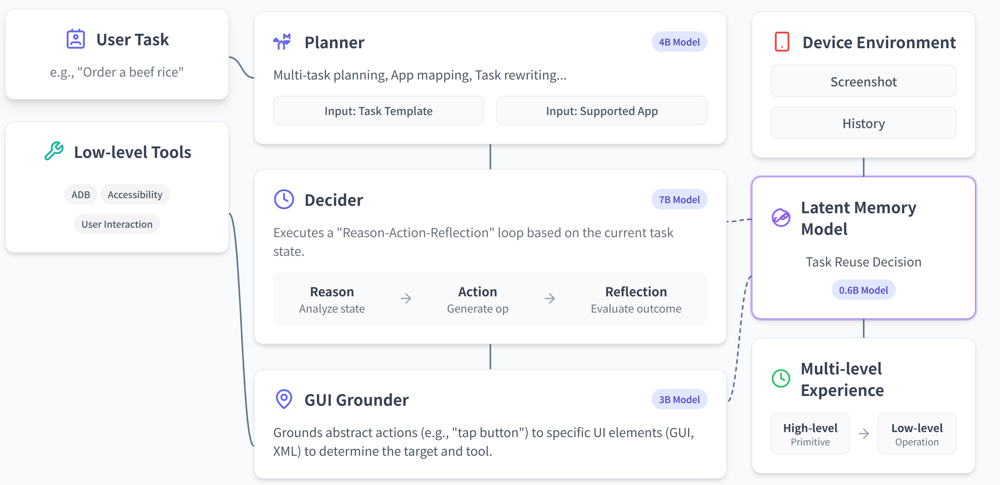

<div align="center">
  <picture>
    
  </picture>
</div>

<h3 align="center">
MobiAgent: A Systematic Framework for Customizable Mobile Agents
</h3>

<p align="center">
| <a href="https://arxiv.org/abs/2509.00531"><b>MobiAgent Paper</b></a> | <a href="https://arxiv.org/abs/2512.15784"><b>MobiMem Paper</b></a> | <a href="https://huggingface.co/collections/IPADS-SAI/mobimind-68b2aad150ccafd9d9e10e4d"><b>Huggingface</b></a> | <a href="https://github.com/IPADS-SAI/MobiAgent/releases/tag/v1.0.1"><b>App</b></a> |
</p> 

<p align="center">
 <strong>English</strong> | <a href="README_zh.md">中文</a>
</p> 

---

## About

**MobiAgent** is a powerful and customizable mobile agent system including:

* **An agent model family**: MobiMind
* **An agent acceleration framework**: AgentRR
* **An agent benchmark**: MobiFlow

**System Architecture:**

<div align="center">
<p align="center">
  
</p>
</div>

## News
- [2025.12.26] 📱 **Pure on-device inference on smartphones is now supported!** See [`phone_runner/README.md`](phone_runner/README.md) to get started.
- [2025.12.25] 🛠️ We've released **unified GUI agent runner** supporting one-click config of multiple models (`MobiAgent`, `UI-TARS`, `AutoGLM`, `Qwen-VL`, `Gemini`, etc.). See [Unify Runner README](https://github.com/IPADS-SAI/MobiAgent/blob/unify-runner/runner/RUNNER_README.md) to get started.
- [2025.12.08] 🔥 We've released [MobiMind-Reasoning-4B](https://huggingface.co/IPADS-SAI/MobiMind-Reasoning-4B-1208) and its quantized version [MobiMind-Reasoning-4B-AWQ](https://huggingface.co/IPADS-SAI/MobiMind-Reasoning-4B-1208-AWQ). 
- [2025.11.03] Added multi-task execution support. See [Multi-task README](runner/mobiagent/multi_task/README.md) for details. 
- [2025.11.03] Introduced a user profile memory system, enabled via `--user_profile on`. See [User Profile README](runner/README.md#user-profile--preference-memory-mem0graphrag) for details.

<details><summary>Full News</summary>
<ul>
  <li>[2025.10.31] We've updated the MobiMind-Mixed model based on Qwen3-VL-4B-Instruct! Download it at <a href="https://huggingface.co/IPADS-SAI/MobiMind-Mixed-4B-1031">MobiMind-Mixed-4B-1031</a>.</li>
  <li>[2025.9.30] Added an experience memory module.</li>
  <li>[2025.9.29] We've open-sourced a mixed version of MobiMind, capable of both Decider and Grounder tasks! Download it at <a href="https://huggingface.co/IPADS-SAI/MobiMind-Mixed-7B">MobiMind-Mixed-7B</a>.</li>
</ul>
</details>

- [2025.8.30] We've open-sourced MobiAgent!

## Evaluation Results

<div align="center">
<p align="center">
  
  
  
</p>
</div>

<div align="center">
<p align="center">
  
</p>
</div>

## Demo

**Mobile App Demo**:
<div align="center">
  <video src="https://github.com/user-attachments/assets/ab748578-7d17-47e1-a47c-4d9c3d34b28f"/>
</div>

**AgentRR Demo** (Left: first task; Right: subsequent task)
<div align="center">
  <video src="https://github.com/user-attachments/assets/ef5268a2-2e9c-489c-b8a7-828f00ec3ed1"/>
</div>

**Multi Task Demo**

task: `在小红书查找2025年性价比最高的单反相机推荐，然后在淘宝搜索该相机，并将淘宝中的相机品牌、名称和价格通过微信发送给小赵。`
<div align="center">
  <video src="https://github.com/user-attachments/assets/92fdf23c-71d6-4c67-b02a-c3fa13fcc0e7"/>
</div>

## Project Structure

- `agent_rr/` - Agent Record & Replay framework
- `collect/` - Data collection, annotation, processing and export tools
- `runner/` - Agent executor that connects to phone via ADB, executes tasks, and records execution traces
- `MobiFlow/` - Agent evaluation benchmark based on milestone DAG
- `app/` - MobiAgent Android app
- `deployment/` - Service deployment for MobiAgent mobile application

## Quick Start

### Use with MobiAgent APP

If you would like to try MobiAgent directly with our APP, please download it in [Download Link](https://github.com/IPADS-SAI/MobiAgent/releases/tag/v1.0.1) and enjoy yourself!

### Use with Python Scripts

If you would like to try MobiAgent with python scripts which leverage Android Debug Bridge (ADB) to control your phone, please follow these steps:

#### 1. Environment Setup

Create virtual environment, e.g., using conda:

```bash
conda create -n MobiMind python=3.10
conda activate MobiMind
```

Simplest environment setup (in case you want to run the agent runner alone):

```bash
# Install simplest dependencies
pip install -r requirements_simple.txt
```

Full environment setup (in case you want to run the full pipeline): 

```bash
pip install -r requirements.txt

# Download OmniParser model weights
for f in icon_detect/{train_args.yaml,model.pt,model.yaml} ; do huggingface-cli download microsoft/OmniParser-v2.0 "$f" --local-dir weights; done

# Download embedding model utils
huggingface-cli download BAAI/bge-small-zh --local-dir ./utils/experience/BAAI/bge-small-zh

# Install OCR utils (optional)
sudo apt install tesseract-ocr tesseract-ocr-chi-sim

# If you need GPU acceleration for OCR, install paddlepaddle-gpu according to your CUDA version
# For details, refer to https://www.paddlepaddle.org.cn/install/quick, CUDA 11.8 for example:
python -m pip install paddlepaddle-gpu>=3.1.0 -i https://www.paddlepaddle.org.cn/packages/stable/cu118/

```

#### 2. Mobile Device Setup

- Download and install [ADBKeyboard](https://github.com/senzhk/ADBKeyBoard/blob/master/ADBKeyboard.apk) on your Android device
- Enable Developer Options on your Android device and allow USB debugging
- Connect your phone to the computer using a USB cable

#### 3. Model Deployment

After downloading the model checkpoints, use vLLM to deploy model inference services:

download urls:
- MobiMind-1.5-4B(***fastest&experimental**, support [e2e](https://github.com/IPADS-SAI/MobiAgent/blob/a782deae95fa33159ada0bb04d449be6e71e5e1c/runner/mobiagent/mobiagent.py#L1089)*):
  -  [huggingface](https://huggingface.co/IPADS-SAI/MobiMind-1.5-4B-1220)
  -  [modelscope](https://www.modelscope.cn/models/fengerhu1/MobiMind-1.5-4B-1220)
- MobiMind-Reasoning-4B(**stable**):
  - [huggingface](https://huggingface.co/IPADS-SAI/MobiMind-Reasoning-4B-1208)
  - [modelscope](https://www.modelscope.cn/models/fengerhu1/MobiMind-Reasoning-4B-1208)

```bash
vllm serve MobiMind-Reasoning-4B --port <decider/grounder port>
vllm serve Qwen/Qwen3-4B-Instruct --port <planner port>
```

#### 4. Agent Memory Setup (Optional)

MobiAgent supports three types of memory systems to enhance agent performance:

##### 4.1 User Profile Memory

User preference memory system (Mem0) provides personalized context for planning. To enable it, set up the backend storage:

Milvus (Vector Database) - Required for vector search:

```bash
# Download the installation script
curl -sfL https://raw.githubusercontent.com/milvus-io/milvus/master/scripts/standalone_embed.sh -o standalone_embed.sh
# Start the Docker container
bash standalone_embed.sh start
```

Add to your `.env` file:
```bash
MILVUS_URL=http://localhost:19530
EMBEDDING_MODEL=BAAI/bge-small-zh
EMBEDDING_MODEL_DIMS=384
OPENAI_API_KEY=your_key_here
OPENAI_BASE_URL=your_llm_endpoint_here
```

Neo4j (GraphRAG) - Optional for graph-based retrieval:

```bash
docker run -d --name neo4j \
  -p 7474:7474 -p 7687:7687 \
  -e NEO4J_AUTH=neo4j/testpassword \
  neo4j:5.23.0
```

Add to your `.env` file:
```bash
NEO4J_URL=neo4j://localhost:7687
NEO4J_USERNAME=neo4j
NEO4J_PASSWORD=testpassword
```

For detailed configuration, see [runner README](runner/README.md#用户画像与偏好记忆).

##### 4.2 Experience Memory

Experience memory enables the planner to retrieve and use similar past task execution experiences. Enable it by adding the `--use_experience` flag when launching the agent runner.

##### 4.3 Action Memory

Action memory (AgentRR) caches and reuses successful action sequences to accelerate task execution. For ActTree reproduction and evaluation, see [AgentRR README (ActTree)](agent_rr/README.md). For ActChain (experience-based action memory) which is being integrated with Agent Runner as an experimental feature, see [#49](https://github.com/IPADS-SAI/MobiAgent/pull/49).

#### 5. Launch Agent Runner

Write the list of tasks that you would like to test in `runner/mobiagent/task.json`, then launch agent runner:

Basic launch:
```bash
python -m runner.mobiagent.mobiagent \
  --service_ip <Service IP> \
  --decider_port <Decider Service Port> \
  --grounder_port <Grounder Service Port> # Same as Decider Port, be ignored when using --e2e flag \
  --planner_port <Planner Service Port>
```

With user profile memory:
```bash
python -m runner.mobiagent.mobiagent \
  --service_ip <Service IP> \
  --decider_port <Decider Service Port> \
  --grounder_port <Grounder Service Port> # Same as Decider Port, be ignored when using --e2e flag \
  --planner_port <Planner Service Port> \
  --user_profile on \
  --use_graphrag off  # Use 'on' for GraphRAG (Neo4j), 'off' for vector search (Milvus)
```

Common parameters:

- `--service_ip`: Service IP (default: `localhost`)
- `--decider_port`: Decider service port (default: `8000`)
- `--grounder_port`: Grounder service port (default: `8001`)
- `--planner_port`: Planner service port (default: `8002`)
- `--e2e`:End-to-end mode, reducing grounder calls (default: `false`)
- `--device`: Device type, `Android` or `Harmony` (default: `Android`)
- `--user_profile`: Enable user profile memory, `on` or `off` (default: `off`)
- `--use_graphrag`: Use GraphRAG (Neo4j) for retrieval, `on` or `off` (default: `off`)
- `--use_experience`: Enable experience-based task rewriting (default: `False`)
- `--data_dir`: Directory to save result data (default: `runner/mobiagent/data/`)
- `--task_file`: Path to the task list file (default: `runner/mobiagent/task.json`)

The runner automatically controls the device and invoke agent models to complete the pre-defined tasks.

**Important**: If you deploy MobiMind-Reasoning-4B model inference, set both decider/grounder ports to `<decider/grounder port>`.

For all available parameters, see [runner README](runner/README.md#项目启动).

## Detailed Sub-module Usage

For detailed usage instructions, see the `README.md` files in each sub-module directory.

## Citation

If you find MobiAgent useful in your research, please feel free to cite our [paper](https://arxiv.org/abs/2509.00531):

```
@misc{zhang2025mobiagentsystematicframeworkcustomizable,
  title={MobiAgent: A Systematic Framework for Customizable Mobile Agents}, 
  author={Cheng Zhang and Erhu Feng and Xi Zhao and Yisheng Zhao and Wangbo Gong and Jiahui Sun and Dong Du and Zhichao Hua and Yubin Xia and Haibo Chen},
  year={2025},
  eprint={2509.00531},
  archivePrefix={arXiv},
  primaryClass={cs.MA},
  url={https://arxiv.org/abs/2509.00531}, 
}
@misc{liu2025trainingenablingselfevolutionagents,
  title={Beyond Training: Enabling Self-Evolution of Agents with MOBIMEM}, 
  author={Zibin Liu and Cheng Zhang and Xi Zhao and Yunfei Feng and Bingyu Bai and Dahu Feng and Erhu Feng and Yubin Xia and Haibo Chen},
  year={2025},
  eprint={2512.15784},
  archivePrefix={arXiv},
  primaryClass={cs.AI},
  url={https://arxiv.org/abs/2512.15784}, 
}
```

## Acknowledgements
We gratefully acknowledge the open-source projects like MobileAgent, UI-TARS, and Qwen-VL, etc. We also thank the National Innovation Institute of High-end Smart Appliances for their support of this project.

## Star History

[](https://www.star-history.com/#IPADS-SAI/MobiAgent&Date)
