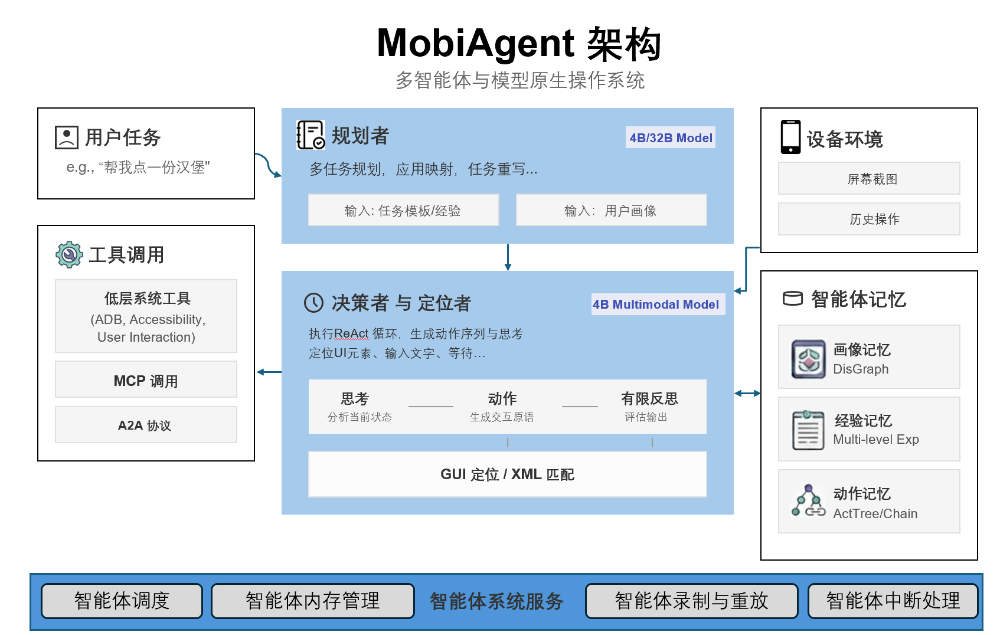
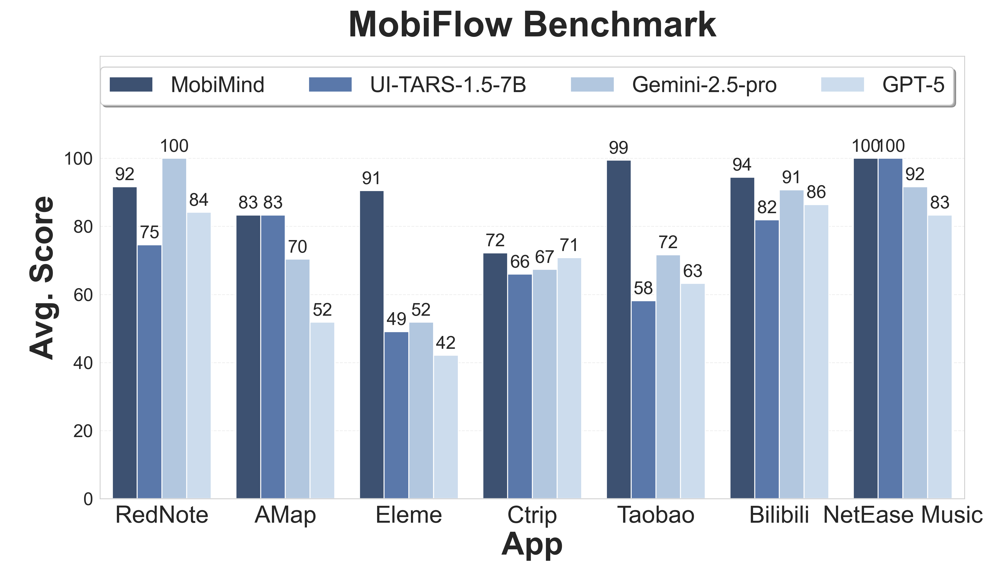
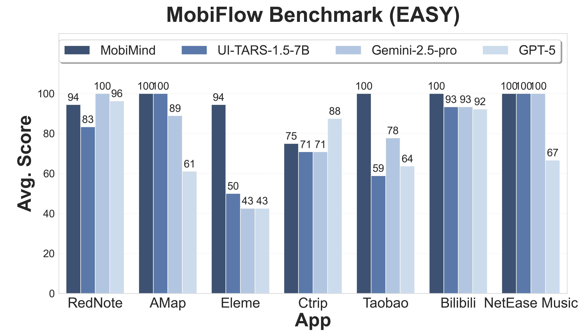
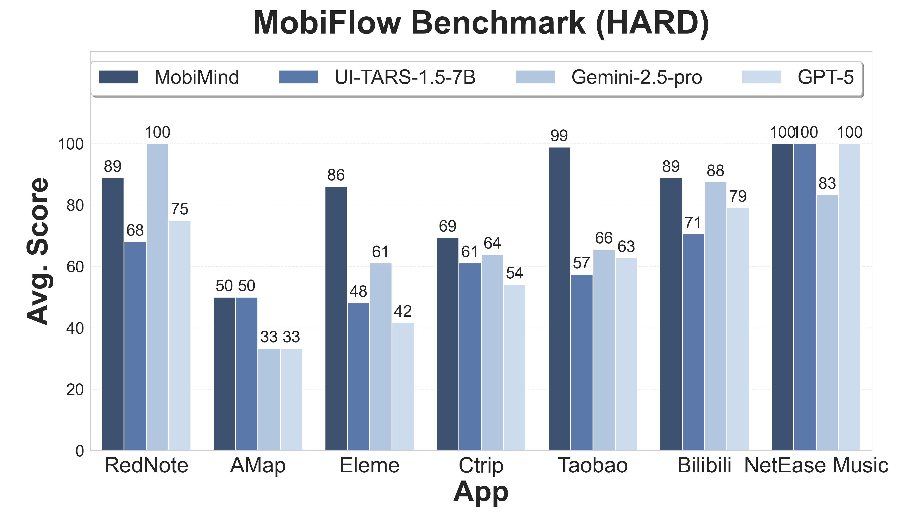
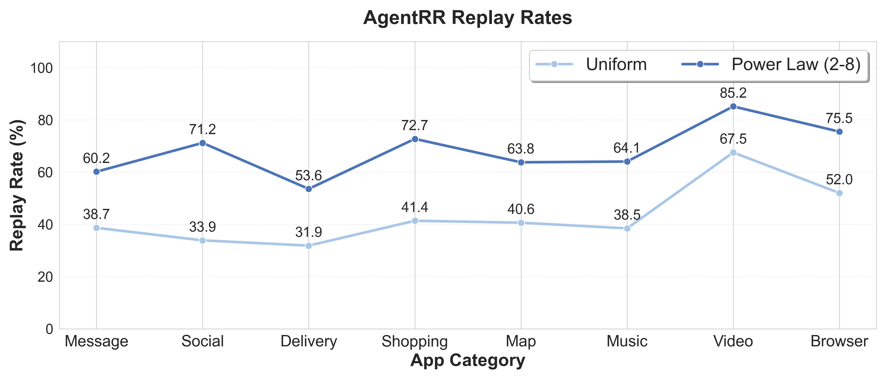

<div align="center">
  <picture>
    
  </picture>
</div>

<h3 align="center">
MobiAgent: A Systematic Framework for Customizable Mobile Agents
</h3>

<p align="center">
| <a href="https://arxiv.org/abs/2509.00531"><b>MobiAgent论文</b></a> | <a href="https://arxiv.org/abs/2512.15784"><b>MobiMem论文</b></a> | <a href="https://huggingface.co/collections/IPADS-SAI/mobimind-68b2aad150ccafd9d9e10e4d"><b>Huggingface</b></a> | <a href="https://github.com/IPADS-SAI/MobiAgent/releases/tag/v1.0.1"><b>App</b></a> |
</p> 

<p align="center">
 <a href="README.md">English</a> | <strong>中文</strong>
</p> 

---

## 简介

**MobiAgent**是一个强大的、可定制的移动端智能体系统，包含：

* **智能体模型家族：** MobiMind
* **智能体加速框架：** AgentRR
* **智能体评测基准：** MobiFlow

**系统架构**:

<div align="center">
<p align="center">
  
</p>
</div>

## 新闻
- [2025.12.26] 📱 **支持手机端纯本地推理！** 详见 [`phone_runner/README.md`](phone_runner/README.md)。
- [2025.12.25] 🛠️ 我们发布了一个[通用GUIAgent执行框架](https://github.com/IPADS-SAI/MobiAgent/blob/unify-runner/runner/RUNNER_README.md)（位于unify-runner分支下的[runner](https://github.com/IPADS-SAI/MobiAgent/blob/unify-runner/runner/RUNNER_README.md)），支持一键配置运行各GUIAgent模型（Mobiagent、UI-TARS、AutoGLM等、以及以Qwen-VL Gemini为代表的VL-LLM）。
- [2025.12.08] 🔥 我们发布了 [MobiMind-Reasoning-4B](https://huggingface.co/IPADS-SAI/MobiMind-Reasoning-4B-1208) 及其量化版本 [MobiMind-Reasoning-4B-AWQ](https://huggingface.co/IPADS-SAI/MobiMind-Reasoning-4B-1208-AWQ)。
- [2025.11.03] 新增多任务执行支持。详见 [多任务 README](runner/mobiagent/multi_task/README.md)。
- [2025.11.03] 引入用户画像记忆系统，通过`--user_profile on`启用。详见 [用户画像 README](runner/README.md#用户画像与偏好记忆)。

<details><summary>完整新闻</summary>
<ul>
  <li>[2025.10.31] 我们更新了基于 Qwen3-VL-4B-Instruct 的 MobiMind-Mixed 模型！下载地址：<a href="https://huggingface.co/IPADS-SAI/MobiMind-Mixed-4B-1031">MobiMind-Mixed-4B-1031</a>。</li>
  <li>[2025.9.30] 新增经验记忆模块。</li>
  <li>[2025.9.29] 我们开源了 MobiMind 混合版本，可同时胜任 Decider 和 Grounder 任务！下载地址：<a href="https://huggingface.co/IPADS-SAI/MobiMind-Mixed-7B">MobiMind-Mixed-7B</a>。</li>
</ul>
</details>

- [2025.8.30] 我们开源了 MobiAgent！

## 评测结果

<div align="center">
<p align="center">
  
  
  
</p>
</div>

<div align="center">
<p align="center">
  
</p>
</div>

## 演示

**移动端应用演示**:
<div align="center">
  <video src="https://github.com/user-attachments/assets/ab748578-7d17-47e1-a47c-4d9c3d34b28f"/>
</div>

**AgentRR 演示** (左：首次任务；右：后续任务)
<div align="center">
  <video src="https://github.com/user-attachments/assets/ef5268a2-2e9c-489c-b8a7-828f00ec3ed1"/>
</div>

**多任务演示**

任务：`在小红书查找2025年性价比最高的单反相机推荐，然后在淘宝搜索该相机，并将淘宝中的相机品牌、名称和价格通过微信发送给小赵。`
<div align="center">
  <video src="https://github.com/user-attachments/assets/92fdf23c-71d6-4c67-b02a-c3fa13fcc0e7"/>
</div>

## 项目结构

- `agent_rr/` - Agent Record & Replay框架
- `collect/` - 数据收集、标注、处理与导出工具
- `runner/` - 智能体执行器，通过ADB连接手机、执行任务、并记录执行轨迹
- `MobiFlow/` - 基于里程碑DAG的智能体评测基准
- `app/` - MobiAgent安卓App
- `deployment/` - MobiAgent移动端应用的服务部署方式

## 快速开始

### 通过 MobiAgent APP 使用

如果您想直接通过我们的 APP 体验 MobiAgent，请通过 [下载链接](https://github.com/IPADS-SAI/MobiAgent/releases/tag/v1.0) 进行下载，祝您使用愉快！

### 使用 Python 脚本

如果您想通过 Python 脚本来使用 MobiAgent，并借助Android Debug Bridge (ADB) 来控制您的手机，请遵循以下步骤进行：

#### 1. 环境配置

创建虚拟环境，例如，使用conda：

```bash
conda create -n MobiMind python=3.10
conda activate MobiMind
```

最简环境（如果您只想运行agent runner）：

```bash
# 安装最简化依赖
pip install -r requirements_simple.txt
```

完整环境（如果您想运行完整流水线）：

```bash
pip install -r requirements.txt

# 下载OmniParser模型权重
for f in icon_detect/{train_args.yaml,model.pt,model.yaml} ; do huggingface-cli download microsoft/OmniParser-v2.0 "$f" --local-dir weights; done

# 下载embedding模型
huggingface-cli download BAAI/bge-small-zh --local-dir ./utils/experience/BAAI/bge-small-zh

# Install OCR utils (可选)
sudo apt install tesseract-ocr tesseract-ocr-chi-sim

# 如果需要使用gpu加速ocr，需要根据cuda版本，手动安装paddlepaddle-gpu
# 详情参考 https://www.paddlepaddle.org.cn/install/quick，例如cuda 11.8版本：
python -m pip install paddlepaddle-gpu>=3.1.0 -i https://www.paddlepaddle.org.cn/packages/stable/cu118/

```

#### 2. 手机配置

- 在Android设备上下载并安装 [ADBKeyboard](https://github.com/senzhk/ADBKeyBoard/blob/master/ADBKeyboard.apk)
- 在Android设备上，开启开发者选项，并允许USB调试
- 使用USB数据线连接手机和电脑

#### 3. 模型部署

下载好模型检查点后，使用 vLLM 部署模型推理服务：

download 地址：
- MobiMind-1.5-4B(***fastest&experimental**, support [e2e](https://github.com/IPADS-SAI/MobiAgent/blob/a782deae95fa33159ada0bb04d449be6e71e5e1c/runner/mobiagent/mobiagent.py#L1089)*):
  -  [huggingface](https://huggingface.co/IPADS-SAI/MobiMind-1.5-4B-1220)
  -  [modelscope](https://www.modelscope.cn/models/fengerhu1/MobiMind-1.5-4B-1220)
- MobiMind-Reasoning-4B(**stable**):
  - [huggingface](https://huggingface.co/IPADS-SAI/MobiMind-Reasoning-4B-1208)
  - [modelscope](https://www.modelscope.cn/models/fengerhu1/MobiMind-Reasoning-4B-1208)

```bash
vllm serve MobiMind-Reasoning-4B --port <mixed port>
vllm serve Qwen/Qwen3-4B-Instruct --port <planner port>
```


#### 4. Agent 记忆系统设置（可选）

MobiAgent 支持三种类型的记忆系统以提升智能体性能：

##### 4.1 用户画像记忆

用户偏好记忆系统（Mem0）为规划阶段提供个性化上下文。要启用它，需要先设置后端存储：

Milvus（向量数据库）- 向量检索必需：

```bash
# 下载安装脚本
curl -sfL https://raw.githubusercontent.com/milvus-io/milvus/master/scripts/standalone_embed.sh -o standalone_embed.sh
# 启动 Docker 容器
bash standalone_embed.sh start
```

在 `.env` 文件中添加：
```bash
MILVUS_URL=http://localhost:19530
EMBEDDING_MODEL=BAAI/bge-small-zh
EMBEDDING_MODEL_DIMS=384
OPENAI_API_KEY=your_key_here
OPENAI_BASE_URL=your_llm_endpoint_here
```

Neo4j（GraphRAG）- 图检索可选：

```bash
docker run -d --name neo4j \
  -p 7474:7474 -p 7687:7687 \
  -e NEO4J_AUTH=neo4j/testpassword \
  neo4j:5.23.0
```

在 `.env` 文件中添加：
```bash
NEO4J_URL=neo4j://localhost:7687
NEO4J_USERNAME=neo4j
NEO4J_PASSWORD=testpassword
```

详细配置说明见 [runner README](runner/README.md#用户画像与偏好记忆)。

##### 4.2 经验记忆

经验记忆使规划器能够检索并使用类似的过往任务执行经验。启动 Agent 执行器时添加 `--use_experience` 参数即可启用。

##### 4.3 动作记忆

动作记忆（AgentRR）缓存并复用成功的动作序列以加速任务执行。关于 ActTree 的复现与评测，见 [AgentRR README (ActTree)](agent_rr/README.md)。ActChain（基于经验的动作记忆）正在作为实验特性集成到 Agent Runner 中，见 [#49](https://github.com/IPADS-SAI/MobiAgent/pull/49)。

#### 5. 启动Agent执行器

在 `runner/mobiagent/task.json` 中写入想要测试的任务列表，然后启动Agent执行器

基础启动：
```bash
python -m runner.mobiagent.mobiagent \
  --service_ip <服务IP> \
  --decider_port <Decider模型端口/Mixed 端口> \
  --grounder_port <Grounder模型端口/Mixed 端口> \
  --planner_port <Planner模型端口>
```

启用用户画像记忆：
```bash
python -m runner.mobiagent.mobiagent \
  --service_ip <服务IP> \
  --decider_port <Decider模型端口> \
  --grounder_port <Grounder模型端口> \
  --planner_port <Planner模型端口> \
  --user_profile on \
  --use_graphrag off  # 使用 'on' 启用 GraphRAG (Neo4j)，'off' 使用向量检索 (Milvus)
```

常用参数：

- `--service_ip`：服务IP（默认：`localhost`）
- `--decider_port`：决策服务端口（默认：`8000`）
- `--grounder_port`：定位服务端口（默认：`8001`）
- `--planner_port`：规划服务端口（默认：`8002`）
- `--device`：设备类型，`Android` 或 `Harmony`（默认：`Android`）
- `--user_profile`：启用用户画像记忆，`on` 或 `off`（默认：`off`）
- `--use_graphrag`：使用 GraphRAG (Neo4j) 进行检索，`on` 或 `off`（默认：`off`）
- `--use_experience`：启用基于经验的任务改写（默认：`False`）

执行器启动后，将会自动控制手机并调用Agent模型，完成列表中指定的任务。

**重要提示**：如果您部署的是 MobiMind-Mixed 模型，请将 decider/grounder 端口都设置为 `<mixed port>`。

所有可用参数说明见 [runner README](runner/README.md#项目启动)。

## 子模块详细使用方式

详细使用方式见各子模块目录下的 `README.md` 文件。

## 引用

如果您在研究中使用了 MobiAgent，欢迎引用我们的[论文](https://arxiv.org/abs/2509.00531)：

```
@misc{zhang2025mobiagentsystematicframeworkcustomizable,
  title={MobiAgent: A Systematic Framework for Customizable Mobile Agents}, 
  author={Cheng Zhang and Erhu Feng and Xi Zhao and Yisheng Zhao and Wangbo Gong and Jiahui Sun and Dong Du and Zhichao Hua and Yubin Xia and Haibo Chen},
  year={2025},
  eprint={2509.00531},
  archivePrefix={arXiv},
  primaryClass={cs.MA},
  url={https://arxiv.org/abs/2509.00531}, 
}
@misc{liu2025trainingenablingselfevolutionagents,
  title={Beyond Training: Enabling Self-Evolution of Agents with MOBIMEM}, 
  author={Zibin Liu and Cheng Zhang and Xi Zhao and Yunfei Feng and Bingyu Bai and Dahu Feng and Erhu Feng and Yubin Xia and Haibo Chen},
  year={2025},
  eprint={2512.15784},
  archivePrefix={arXiv},
  primaryClass={cs.AI},
  url={https://arxiv.org/abs/2512.15784}, 
}
```

## 致谢
我们感谢MobileAgent，UI-TARS，Qwen-VL等优秀的开源工作，同时，感谢国家高端智能化家用电器创新中心对项目的支持。

## Star History

[](https://www.star-history.com/#IPADS-SAI/MobiAgent&Date)
